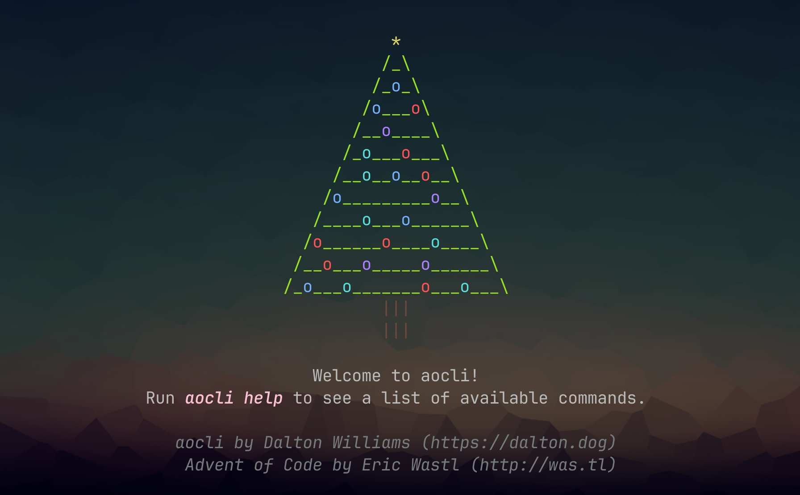
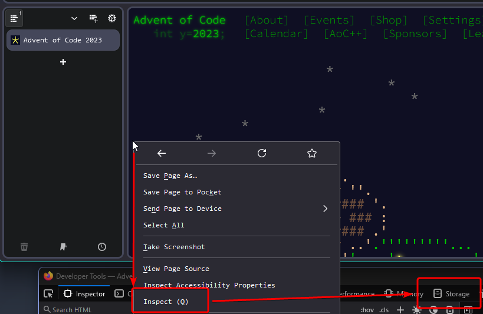
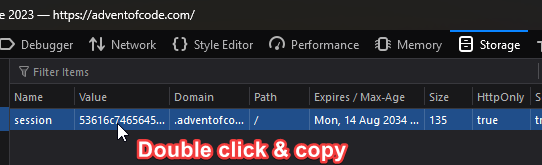
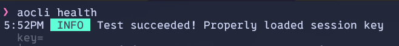

# Welcome to `aocGo`!

`aocGo` is a two part project. It is not an official [Advent of Code](https://adventofcode.com/) project, merely my take on some ways to enhance the workflow.  
Definitely go support the official project, especially since this project would be useless without it.  

> [!IMPORTANT]
> I'm aware that there are some issues now that 2024 has released. Can't say I'm surprised that the first fresh launch revealed some quirks. I'm looking into it, please feel free to leave issues that you notice! Happy coding everyone!

## `aocgo`

The first encompasses the `go` module of the same name. This module contains a main package with some functions for obtaining input for a given day based on the file's directory structure. It also contains an `aocutils` sub-package, containing some helpful functions for common things you might need when solving AoC puzzles. If you want to handle all of that yourself, don't worry about importing this.

This module should be imported using `go get go.dalton.dog/aocgo`.

Example:
```go
// Example file/dir structure:
// 2015/1/main.go
package main

import "go.dalton.dog/aocgo"

func main() {
    // Get your input data as a string, exactly as the input has it
    var inLine string = aocgo.GetInputAsString()

    // Get your input data as an array of strings, created by splitting input on newline characters
    var inLnArr []string = aocgo.GetInputAsLineArray()

    // Get your input data as an array of bytes, where each element is a single byte of the input
    var inByteArr []byte = aocgo.GetInputAsByteArray()
}
```

## `aocli`

The second, and more expansive, is a CLI application called `aocli` that can be used to interact with the Advent of Code workflow without leaving your terminal.



It can currently do all of the following:
- View puzzle data
- Submit puzzle answers
- View both yearly and daily leaderboards
- View an overview of your user

Check out the directory's specific [README](https://github.com/DaltonSW/aocgo/tree/main/cmd/aocli) for detailed documentation!

You should install the program via this repo's ['Releases' page](https://github.com/DaltonSW/aocgo/releases/latest). There are standalone binaries for Windows, Linux, and Mac, and the program has a built-in updating system. Just put the executable in a directory on your PATH and you're good to go.

## Required Setup

All you need for this to work is the cookie session token of the user you'd like to use to interface with Advent of Code.

1. To obtain this token, log in to Advent of Code via whichever method you prefer.
2. Open Dev Tools (Press F12 or Right Click -> Inspect), and then open the `Storage` tab. 

3. With the `Storage` tab open, double click the `value` to select it, and copy it.

4. Once copied, place it in one of these two places:
    - `~/.config/aocgo/session.token`
    - `AOC_SESSION_TOKEN` environment variable  
  
If you choose to use the environment variable method, make sure to include a line to set it in your shell's startup script.

From there, you should be good to go! If you installed the CLI program, you can run `aocli health` to verify that everything loaded properly.



## Licensing

© 2024 Dalton Williams  
Check repository LICENSE file for licensing information.
