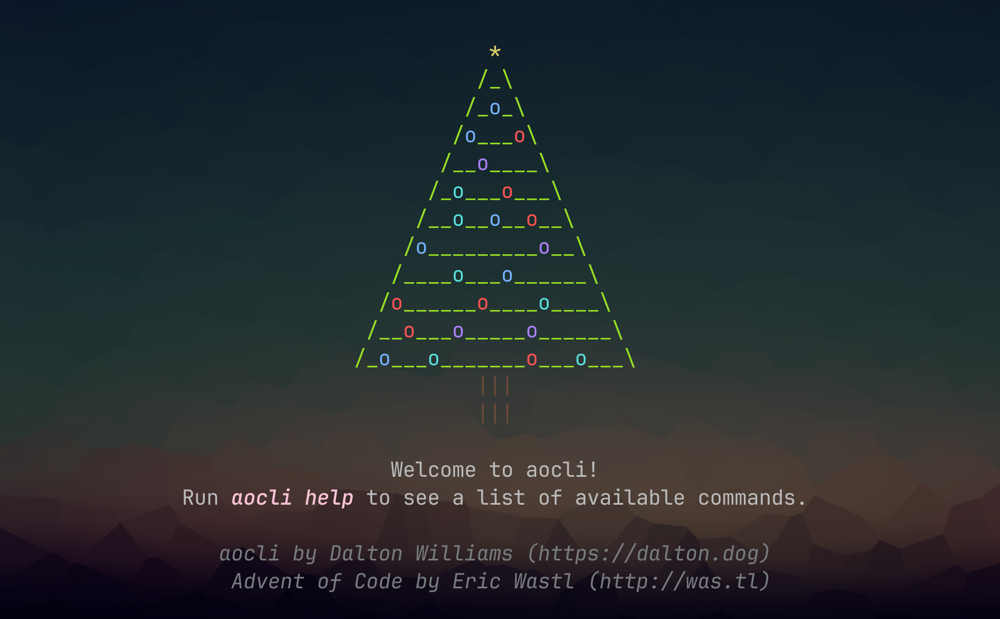

# Welcome to `aocli`

`aocli` is a command line with the goal to provide a snappy, pretty, and functional way to interact with the entire Advent of Code workflow without ever leaving your terminal.

It is implemented with rate limiting and local caching to ensure we're not hitting the servers more often than necessary.

Cached information is stored in `~/.cache/aocgo/<session_token>.db`.

## Available Commands

>[!IMPORTANT]
> The example videos below use an outdated syntax style, I just haven't gotten around to re-recording them yet. The execution is either the same or improved.

Syntax Example: `aocli command_name <RequiredParam> [OptionalParam] -optionOne valueOne -x`

### `help`

Prints out help for the program or for a specific command. If no parameter is specified, all available commands are printed. If a command is specified, command-specific help will be printed out.

Syntax: `aocli help [command]`

### `get`

Allows you to get the user input for a given year and day. Can be passed in as options. If not passed in, will attempt to be derived from the current directory.

Syntax: `aocli get [-y yyyy -d dd]`

### `view`

Allows you to view the puzzle page for a given year and day. Can be passed in as options. If not passed in, will attempt to be derived from the current directory.

Syntax: `aocli view [-y yyyy -d dd]`

### `leaderboard`

Allows you to view the leaderboard for a given year, or given year + day. Passed in as parameters.

Syntax: `aocli leaderboard  <-y yyyy> [-d dd]`

### `user`

Loads all available information for the available user. This essentially runs `view` on every puzzle, but doesn't visualize the puzzle itself. Counts all the user's stars across the days and years, and displays that in a table.  

The `--clear` option will clear the stored information for the user in the session token file, or AOC_SESSION_TOKEN environment variable.
You can also manually delete the database file, located in `~/.cache/aocgo/<session_token>.db`

Syntax: `aocli user [--clear]`

### `submit`

Submits an answer to the puzzle for a given year, day, and part. These can all be passed in as options. If they're not passed in, the directory structure naming will be used to derive the year and day, and the part to submit to will be determined by the current state of the puzzle.
For example, if the puzzle already has a correct answer 1, then it will submit to answer 2. 

Submission validation is in place as well, preventing you from submitting obviously incorrect errors.
For example, you can't submit previously submitted answers, nor can you attempt to submit the answer to part 1 for part 2.

Syntax: `aocli submit <answer> [-y yyyy -d dd --part <1|2>]`

### `version`

Will print out the latest version. Will also check the latest GitHub repo release to see if there's a new version available.

Syntax: `aocli version`

### `update`

Will attempt to download and install the newest version of `aocli` in-place, if there is one newer.

Syntax: `aocli update`

### `reload`

Will reload the contents of the puzzle page for a given year and day. Can be passed in as parameters. If not passed in, will attempt to be derived from the current directory.

Syntax: `aocli reload [-y yyyy -d dd]`

## Licensing

© 2024 Dalton Williams  
Check repository LICENSE file for licensing information.
